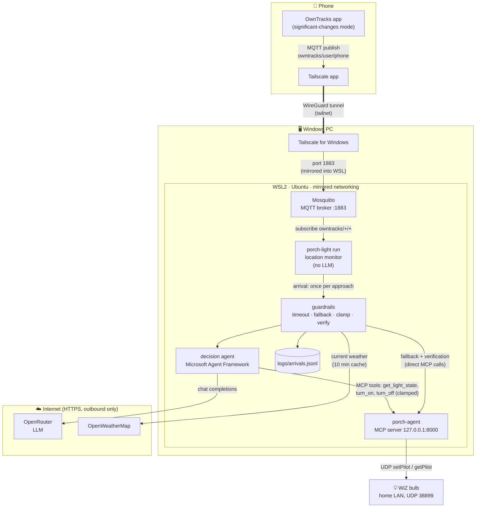
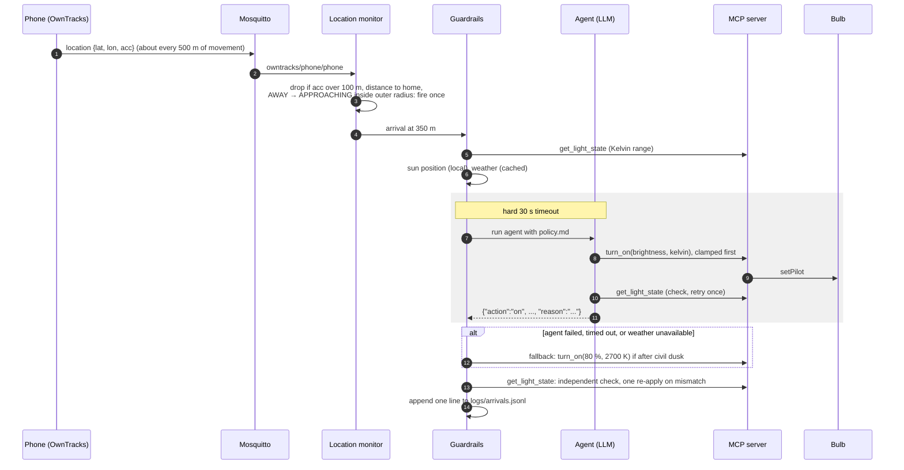
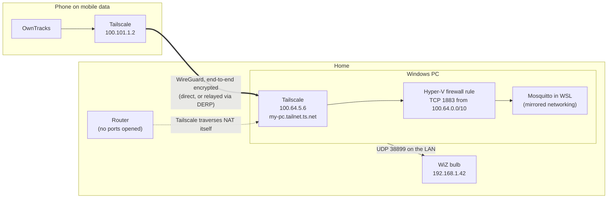
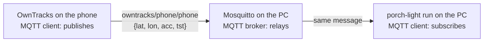

# How to build the porch light system

This guide goes from an empty Windows PC and a phone to a porch light that switches itself on
as you walk up to the house. It covers every piece: the bulb, WSL, the network tunnel, the MQTT
broker, the two Python programs, the phone, and running it all as services.

The [README](../README.md) covers each program in detail. This document covers how the pieces
fit together and the setup that happens outside this repo.

**Contents**

1. [What you are building](#1-what-you-are-building)
2. [How the phone reaches your PC: the tunnel](#2-how-the-phone-reaches-your-pc-the-tunnel)
3. [What you need](#3-what-you-need)
4. [Step 1: the bulb](#step-1-the-bulb)
5. [Step 2: WSL](#step-2-wsl)
6. [Step 3: Tailscale](#step-3-tailscale)
7. [Step 4: Mosquitto (the MQTT broker)](#step-4-mosquitto-the-mqtt-broker)
8. [Step 5: the MCP server](#step-5-the-mcp-server)
9. [Step 6: the porch light agent](#step-6-the-porch-light-agent)
10. [Step 7: the phone](#step-7-the-phone)
11. [Step 8: run everything as services](#step-8-run-everything-as-services)
12. [Step 9: test the whole chain](#step-9-test-the-whole-chain)
13. [Customising the behaviour](#customising-the-behaviour)
14. [Updating](#updating)
15. [Troubleshooting](#troubleshooting)
16. [Security notes](#security-notes)
17. [Known limitations](#known-limitations)

---

## 1. What you are building



There are four moving parts, and each one does one thing:

| Part | Runs on | Job |
| --- | --- | --- |
| **OwnTracks** | Phone | Publishes your location as MQTT messages. |
| **Tailscale** | Phone and Windows | A private encrypted network, so the phone can reach the broker from anywhere without opening a port on your router. |
| **Mosquitto** | WSL | The MQTT broker: receives the phone's messages and hands them to subscribers. |
| **porch-light** (`agent/`) | WSL | Watches the location stream. When you approach home it runs the AI agent, wrapped in deterministic guardrails. |
| **porch-agent** (repo root) | WSL | The MCP server. The only thing that talks to the bulb. |

### What happens when you come home



---

## 2. How the phone reaches your PC: the tunnel

**The problem.** The arrival trigger fires up to 800 m from home, where your phone is usually on
mobile data, not your Wi-Fi. So the phone has to reach the MQTT broker on your PC from
*outside* your home network.

**The solution: Tailscale. No port forwarding, nothing exposed to the internet.**

[Tailscale](https://tailscale.com) builds a private network (a "tailnet") out of your own
devices, using WireGuard tunnels. You install it on the phone and on the Windows PC and sign in
to the same account on both. Each device then gets a stable private address (`100.x.y.z`) and a
name like `my-pc.tailnet-name.ts.net`. The phone connects to the broker at that name wherever it
is: on Wi-Fi at home, on 5G down the street, or abroad.



Things worth knowing:

- **The only open port is MQTT (1883), and only on the tailnet.** The MCP server listens on
  `127.0.0.1` inside WSL and is never reachable from outside. The bulb is only ever reached from
  the PC, over your LAN.
- **No TLS on MQTT.** Tailscale already encrypts everything end to end with WireGuard, so the
  MQTT connection runs as plain text inside the tunnel. The broker still requires a username and
  password.
- **Tailscale runs on Windows, not inside WSL.** Tailscale's guidance is to run it on the
  Windows host only. Running it on both Windows and inside WSL at the same time breaks
  encrypted traffic, because tunnelled packets end up inside another tunnel and no longer fit.
- **WSL uses *mirrored* networking.** In WSL2's default NAT mode, WSL has its own hidden IP
  address. A connection to the PC's Tailscale address then lands on Windows, not on Mosquitto
  in WSL. In mirrored mode WSL shares Windows' network interfaces, so port 1883 on the Tailscale
  address reaches Mosquitto directly, with no port-forwarding rules. The Hyper-V firewall
  still has to allow the port in; that is a single PowerShell command.
- **Outbound traffic needs nothing special.** WSL reaches OpenRouter and OpenWeatherMap over
  HTTPS, and the bulb over UDP on your LAN, exactly as any program on the PC would.

> **Windows 10 or an older Windows 11?** Mirrored networking needs Windows 11 22H2 or later.
> On older versions, install Tailscale *inside* WSL instead of on Windows (not both), with
> systemd enabled. WSL then gets its own tailnet address, and the phone connects to that. The
> rest of this guide is unchanged apart from Step 3.

---

## 3. What you need

| Item | Notes |
| --- | --- |
| A WiZ bulb | Any WiZ bulb with tunable white. It needs a reserved IP address on your LAN. |
| A Windows 11 PC that stays on | 22H2 or later for mirrored networking. It must be on the same LAN as the bulb. |
| An Android or iOS phone | OwnTracks and Tailscale are free on both. |
| A Tailscale account | The free personal plan is plenty. |
| An OpenRouter account and API key | Pay-as-you-go. One arrival costs a fraction of a cent with the default model. |
| An OpenWeatherMap API key | The free tier is enough. It can take a couple of hours to activate after sign-up. |

Software installed along the way: WSL2 with Ubuntu, Python 3.11+, Mosquitto, this repo.

---

## Step 1: the bulb

1. **Set the bulb up in the WiZ app** as normal, on your home Wi-Fi.
2. **Turn off message signing** for the bulb in the WiZ app. Recent WiZ firmware requires
   signed commands, which the library this project uses (pywizlight) cannot produce. With
   signing on, reads work but every write fails with `[bulb_rejected]`.
3. **Give the bulb a fixed address.** In your router's DHCP settings, reserve an IP address
   for the bulb's MAC address, for example `192.168.1.42`. The server addresses the bulb by IP,
   so the address must not change.

---

## Step 2: WSL

In **PowerShell as Administrator**:

```powershell
wsl --install -d Ubuntu     # skip if you already have it
wsl --update                # mirrored networking needs a recent WSL
wsl --version               # WSL version should be 2.x
```

Create or edit `.wslconfig` in your Windows home folder (for example `C:\Users\you\.wslconfig`).
From PowerShell:

```powershell
notepad "$HOME\.wslconfig"     # Notepad offers to create the file if it doesn't exist
```

Put this in it and save:

```ini
[wsl2]
# Share Windows' network interfaces, including Tailscale, with WSL.
networkingMode=mirrored
# Keep the VM running when no terminal is open.
vmIdleTimeout=-1

[general]
# Keep the Ubuntu instance running when no terminal is open.
instanceIdleTimeout=-1
```

Then check the file was saved under the right name (not `.wslconfig.txt`):

```powershell
Get-Content "$HOME\.wslconfig"
```

> WSL shuts itself down shortly after the last terminal closes unless told otherwise, and its
> idle settings have changed between releases. If services stop when you close the terminal,
> check the current keys in Microsoft's
> [WSL configuration docs](https://learn.microsoft.com/windows/wsl/wsl-config) against
> `wsl --version`.

Inside Ubuntu, enable systemd so services can start on their own. Edit `/etc/wsl.conf`:

```ini
[boot]
systemd=true
```

Then restart WSL from PowerShell and confirm mirrored mode is on:

```powershell
wsl --shutdown
wsl -d Ubuntu -- ip -brief addr   # should list the same addresses as Windows (ipconfig)
```

The second command only *checks*; it changes nothing. What makes mirrored mode permanent is the
`networkingMode=mirrored` line in `.wslconfig`, which WSL reads every time it starts. If it says
there is no distribution called `Ubuntu`, yours has a different name (such as `Ubuntu-24.04`):
`wsl -l -v` lists the exact names. Once Tailscale is installed (Step 3), its `100.x.y.z`
address should appear in this list too.

Allow inbound MQTT through the Hyper-V firewall that sits in front of WSL. This is PowerShell as
Administrator. `{40E0AC32-...}` is the fixed ID Windows uses for WSL, and `100.64.0.0/10` is the
Tailscale address range, so only tailnet devices are let in:

```powershell
New-NetFirewallHyperVRule -Name "WSL-MQTT-Tailscale" -DisplayName "WSL: MQTT from tailnet" `
  -Direction Inbound -VMCreatorId '{40E0AC32-46A5-438A-A0B2-2B479E8F2E90}' `
  -Protocol TCP -LocalPorts 1883 -RemoteAddresses 100.64.0.0/10
```

In Ubuntu, install the basics:

```bash
sudo apt update
sudo apt install -y python3 python3-venv python3-pip git mosquitto mosquitto-clients
python3 --version   # must be 3.11 or later
```

---

## Step 3: Tailscale

1. **Windows:** download the Windows installer from
   [pkgs.tailscale.com/stable/#windows](https://pkgs.tailscale.com/stable/#windows), install it
   on Windows itself (not inside WSL; see [section 2](#2-how-the-phone-reaches-your-pc-the-tunnel)),
   and sign in. Set it to start on boot (the default) and consider disabling key expiry for this
   machine in the Tailscale admin console, so it doesn't drop off the tailnet after a few months.
2. **Phone:** install the Tailscale app from the App Store or Play Store and sign in to the same
   account.
3. **Keep the phone's tunnel up all the time.** OwnTracks can only deliver fixes while Tailscale
   is connected.
   - **Android:** in system settings, set Tailscale as the *Always-on VPN*.
   - **iOS:** in the Tailscale app, enable *VPN On Demand*.
4. **Find the PC's tailnet name.** In the Tailscale admin console (Machines), or by running
   `tailscale status` on Windows, find something like `my-pc.tailnet-name.ts.net`. That name
   (MagicDNS) is what the phone will connect to. The `100.x.y.z` address works too.

Optionally, in the Tailscale access controls, allow the phone to reach only `my-pc:1883`.

---

## Step 4: Mosquitto (the MQTT broker)

[Mosquitto](https://mosquitto.org) is the open-source MQTT broker from the Eclipse Foundation.
There is only one Mosquitto, so there is no separate "Eclipse version" to choose. Step 2 already
installed it from Ubuntu's own package repository (`mosquitto`), along with the same project's
command-line tools (`mosquitto-clients`: `mosquitto_sub` and `mosquitto_pub`, used below for
testing). Check it is version 2.x, which the config below is written for:

```bash
mosquitto -h | head -1      # e.g. "mosquitto version 2.0.18"
```

Mosquitto runs only here, on the PC. The phone does not need it: OwnTracks connects to this
broker as a client (Step 7).

Ubuntu's package is all this project needs. If you ever want a newer release than Ubuntu ships,
Eclipse publishes its own PPA (`ppa:mosquitto-dev/mosquitto-ppa`).

Mosquitto 2.x only listens on localhost until you configure it otherwise, and it rejects
anonymous clients as soon as a listener is configured. Create
`/etc/mosquitto/conf.d/porch.conf`:

```conf
listener 1883
allow_anonymous false
password_file /etc/mosquitto/passwd
```

Create two users: one for the phone and one for the monitor (you'll be asked for each password):

```bash
sudo mosquitto_passwd -c /etc/mosquitto/passwd phone   # -c creates the file: first user only
sudo mosquitto_passwd    /etc/mosquitto/passwd porch
sudo chown mosquitto:mosquitto /etc/mosquitto/passwd
sudo chmod 600 /etc/mosquitto/passwd
sudo systemctl enable --now mosquitto
sudo systemctl restart mosquitto
```

Only the *first* `mosquitto_passwd` has `-c`: it creates the file, so running it again for a
second user wipes the first. To reset a forgotten password, run it again without `-c`, then
`sudo systemctl restart mosquitto`.

Check it from inside WSL. In these commands, replace `YOUR_PORCH_PASSWORD` with the real
password you just set for `porch`, keeping the single quotes:

```bash
# terminal A
mosquitto_sub -h localhost -u porch -P 'YOUR_PORCH_PASSWORD' -t 'owntracks/#' -v
# terminal B
mosquitto_pub -h localhost -u porch -P 'YOUR_PORCH_PASSWORD' -t owntracks/test/test -m hello
```

Terminal A should print `owntracks/test/test hello`.

---

## Step 5: the MCP server

From WSL, in your **Linux** home directory (`cd ~` first). Don't clone under `/mnt/c/...`,
the Windows drive: virtualenvs there are slow and run into permission problems.

```bash
cd ~
git clone https://github.com/steveh250/Porch-Agent.git
cd Porch-Agent
git switch main      # if you cloned earlier, also run: git pull
python3 -m venv .venv
.venv/bin/pip install -e .
cp .env.example .env
nano .env        # set WIZ_BULB_IP=192.168.1.42 (the reserved address)
```

Leave `MCP_HOST` at its default of `127.0.0.1`: only the agent, on the same machine, needs it.

Start it and prove it can drive the bulb:

```bash
.venv/bin/porch-agent                 # terminal A: "Bulb at ... is now reachable"
.venv/bin/python harness.py           # terminal B: cycles the light, then restores it
```

The harness should end with every check passing. If writes fail with `[bulb_rejected]`, go back
to Step 1.2.

---

## Step 6: the porch light agent

The agent is a separate project with its own virtualenv (the README explains why):

```bash
cd ~/Porch-Agent/agent
python3 -m venv .venv
.venv/bin/pip install -e ".[dev]"
cp config.example.yaml config.yaml
cp .env.example .env
```

**`config.yaml`** is now a full copy of the example, with every setting. You only need to
**change** the lines below; everything else can keep its default. Open it with
`nano config.yaml`, find each of these sections, and edit them in place:

```yaml
home:
  lat: 51.50100          # CHANGE: your front door; see "Getting your home coordinates" below
  lon: -0.14200          # CHANGE
  timezone: Europe/London  # CHANGE: your IANA zone, e.g. America/New_York
presence:
  outer_radius_m: 800    # CHANGE from 400: must be larger than OwnTracks' ~500 m reporting step (Step 7)
  inner_radius_m: 400    # CHANGE from 200
mqtt:
  username: porch        # the monitor's Mosquitto user from Step 4. Must not start with "#".
```

Edit each setting where it already is; don't paste a second copy of a section or line. Plain
YAML would silently keep the **last** of two identical keys, so a second, empty `username:`
(or a second `mqtt:` block) would quietly undo the first. `porch-light` refuses such a file
instead and names both lines:

```text
Configuration error: config.yaml, line 63: 'mqtt' is defined twice (first on line 15). YAML would silently use the last one; delete one of them.
```

The example values above (a spot in London) are placeholders: if they're left in, the agent
measures your arrivals against the wrong place. YAML is indentation-sensitive, so keep the two
spaces in front of each setting.

To check the file was picked up, start the monitor (`.venv/bin/porch-light -v run`): its first
line should show **your** coordinates and `outer 800 m, inner 400 m`, followed by
`Connected to MQTT`. If you see `51.50100, -0.14200` or `Not authorized`, you are still on the
example values: check you edited `config.yaml` (not `config.example.yaml`) in `~/Porch-Agent/agent`.
To see exactly what the agent loaded (the password's length is shown, not the password):

```bash
.venv/bin/python -c "
from porch_light.config import load_config
c = load_config('config.yaml')
print('home:', c.home.lat, c.home.lon, c.home.timezone)
print('radii:', c.presence.outer_radius_m, c.presence.inner_radius_m)
print('mqtt username:', repr(c.mqtt.username), '| password length:', len(c.mqtt.password or ''))
"
```

`mqtt username: None` means the `username:` line is commented out, mis-indented or has no value.

**The resting light.** By default, `porch-light run` also keeps the porch light at a dim
**20 % / 2700 K from civil dusk to civil dawn**, and off in daylight. When you arrive, the agent
brightens it for you; **10 minutes** later it drops back to the dim resting level. It only
changes the light at dusk, at dawn, after an arrival and when it starts up, so if you set the
light by hand, it is left alone until the next of those. To change the level or the delay, or to
turn it off, edit the `resting:` section of `config.yaml` (`enabled: false` disables it). If your
`config.yaml` was copied before this feature existed, it has no `resting:` section; the
defaults above apply.

**Getting your home coordinates.** The most accurate source is OwnTracks itself, because then
you're using the same GPS readings the monitor will see when you arrive. Once the phone is
publishing (Step 7), stand at the front door and run this in WSL:

```bash
mosquitto_sub -h localhost -u porch -P 'YOUR_PORCH_PASSWORD' -t 'owntracks/#' -v
```

Tap OwnTracks' publish button, and copy `lat` and `lon` from the message into `home:` above.
Use a message with a small `acc` (accuracy in metres; under about 20 is good). Outdoors gives a
better fix than inside. If you're setting this up before the phone is ready, right-click the
door in Google Maps to copy its coordinates, and swap in the OwnTracks values later.

In **`.env`**:

```bash
OPENROUTER_API_KEY=sk-or-...
OWM_API_KEY=...
MQTT_PASSWORD=YOUR_PORCH_PASSWORD
```

Use the real values, one per line, as `NAME=value`: no quotes, no spaces around `=`, and no
leftover placeholder text.

Optionally edit **`policy.md`**, the plain-English rules the agent follows.

Check it offline first. This needs no bulb, keys or broker:

```bash
.venv/bin/pytest
.venv/bin/porch-light simulate sim/arrival.jsonl --fake-light --force-fallback --at 2026-11-20T21:30
```

The files in `sim/` are laid out around the example (London) coordinates, so once
`config.yaml` has your home they never come near enough to fire. Generate a walk home for your
own coordinates instead. This writes `sim/home.jsonl`, a route from 1.5 km north of your door:

```bash
.venv/bin/python - <<'EOF' > sim/home.jsonl
import json
from porch_light.config import load_config
home = load_config("config.yaml").home
for north_m in (1500, 1100, 700, 350, 50, 5):   # a walk home from 1.5 km north
    print(json.dumps({"_type": "location", "acc": 10, "lon": home.lon,
                      "lat": round(home.lat + north_m / 111195, 6)}))
EOF
```

Then run a full simulated arrival: the real LLM, real weather and the real bulb, with the server
from Step 5 running. `--at` pretends it is that time, so this works in daylight:

```bash
.venv/bin/porch-light simulate sim/home.jsonl --at 2026-11-20T19:30   # evening: light on
.venv/bin/porch-light simulate sim/home.jsonl --at 2026-11-20T13:00   # midday: left alone
```

The summary should show `"decided_by": "agent"`, a one-sentence `reason`, and
`"verification": {"ok": true`. `"fallback_used": true` means something failed; the `errors`
list says what (usually a key that is wrong or not active yet).

### Run it by hand

Before setting up services (Step 8), run both programs in two terminals:

```bash
# terminal 1: the MCP server
cd ~/Porch-Agent && .venv/bin/porch-agent
# terminal 2: the monitor and agent
cd ~/Porch-Agent/agent && .venv/bin/porch-light -v run
```

Normal startup output looks like this:

```text
Home at 51.50100, -0.14200; outer 800 m, inner 400 m; model google/gemini-2.5-flash; MCP http://127.0.0.1:8000/mcp
Resting light: 20 % / 2700 K from civil dusk to dawn, off in daylight; back to resting 10 min after an arrival
Connected to MQTT localhost:1883; subscribing to owntracks/+/+
Presence unknown -> near at 2 m (fix is 1420 s old)
Resting light: off
```

- **`fix is 1420 s old` on the first line is normal.** OwnTracks publishes with *retain*, so
  Mosquitto hands a new subscriber the phone's last message straight away, however old. The
  first fix after startup only sets the starting state and never fires.
- **`Discarding fix with accuracy 343 m`** (with `-v`) is also normal indoors, where the phone
  falls back to a rough Wi-Fi or cell position. Only fixes within `max_accuracy_m` count.
- `-v` prints a lot of HTTP detail. To see just the important lines:

  ```bash
  .venv/bin/porch-light -v run 2>&1 | grep -E "Home at|Connected|Presence|Arrival|Resting|Discarding|WARNING|ERROR"
  ```

Ctrl+C stops either program.

---

## Step 7: the phone

The phone needs exactly two apps: **Tailscale** (set up in Step 3) and **OwnTracks**. You do
not install Mosquitto, or anything else MQTT-related, on the phone.

### How OwnTracks sends your location: MQTT is built in

MQTT is a simple messaging protocol with two roles:

- A **broker** sits in the middle and relays messages. That's Mosquitto, on the PC.
- **Clients** connect to the broker. A client can *publish* a message to a named *topic*, or
  *subscribe* to a topic to receive whatever is published there.

**OwnTracks is an MQTT client.** The MQTT code is part of the app itself, much as an email app
has everything it needs to talk to a mail server. When you set OwnTracks' connection mode to
**MQTT** and give it the broker's address, port, username and password, the app:

1. opens a connection to Mosquitto on the PC (through the Tailscale tunnel) and logs in;
2. keeps that connection open in the background;
3. each time it has a new location, publishes a small JSON message to the topic
   `owntracks/<username>/<device>`, for example:

   ```json
   {"_type":"location","lat":51.5012,"lon":-0.1419,"acc":12,"tst":1790000000,"tid":"sh"}
   ```

   `acc` is the accuracy in metres; `tst` is when the fix was taken.

On the PC, `porch-light run` is also an MQTT client. It *subscribes* to `owntracks/+/+`, so
Mosquitto hands it every location the phone publishes:



The phone and `porch-light` never talk to each other directly; the broker connects them. If the
phone briefly loses its connection, OwnTracks keeps new locations in a queue and sends them
when it reconnects. That's why the monitor ignores fixes that are too old (see
[Known limitations](#known-limitations)).

OwnTracks also has an **HTTP** mode, which posts locations to a web server instead. This project
uses **MQTT** mode, so make sure that is selected below.

### Set up the MQTT connection in OwnTracks

This connects OwnTracks to Mosquitto on your PC. Menu names differ a little between Android
and iOS and between app versions, but the fields are the same.

**Before you start, have these to hand:**

| You need | Where it comes from | Example |
| --- | --- | --- |
| The PC's tailnet name | Step 3 (`tailscale status` on Windows, or the admin console) | `my-pc.tailnet-name.ts.net` |
| The port | Mosquitto's listener (Step 4) | `1883` |
| The phone's MQTT username and password | `mosquitto_passwd ... phone` (Step 4) | `phone` / your password |

Also check that **Tailscale is connected on the phone**. Without it, the tailnet name doesn't
resolve and OwnTracks can't reach the PC.

**1. Install OwnTracks and grant permissions.**

- Install **OwnTracks** from the App Store or Play Store and open it.
- Allow location access **all the time** ("Always" on iOS; "Allow all the time" on Android,
  which you may have to choose in the phone's *Settings → Apps → OwnTracks → Permissions →
  Location*). With "only while using the app", the phone stops reporting once OwnTracks is in
  the background, so arrivals are never detected.
- **Android only:** exclude OwnTracks from battery optimisation (*Settings → Apps → OwnTracks
  → Battery → Unrestricted*, or *Settings → Battery → Battery optimisation*). Otherwise Android
  may put it to sleep.

**2. Open the connection settings.**

- **Android:** open the menu (☰, top left) → **Preferences** → **Connection**.
- **iOS:** tap the **ⓘ** button (top left) → **Settings**.

**3. Fill in the fields.**

| Setting | Android: under *Connection* | iOS | Set it to |
| --- | --- | --- | --- |
| Mode | **Mode** | **Mode** | **MQTT**. Some versions call it *Private MQTT*. Not HTTP. |
| Host | **Host → Host** | **Host** | The PC's tailnet name, e.g. `my-pc.tailnet-name.ts.net`. Just the name: no `http://`, `mqtt://` or port. The `100.x.y.z` address also works. |
| Port | **Host → Port** | **Port** | `1883` |
| WebSockets | **Host → WebSockets** | **WebSockets** (if shown) | **Off** |
| Authentication | *(always on when a username is set)* | **Authentication** | **On** |
| Username | **Identification → Username** | **UserID** | `phone` |
| Password | **Identification → Password** | **Password** | the phone's Mosquitto password |
| Device ID | **Identification → Device ID** | **DeviceID** | `phone` (any short name, no spaces) |
| Tracker ID | **Identification → Tracker ID** | **TrackerID** | two letters shown on the map, e.g. `sh` |
| TLS | **Security → TLS** | **TLS** | **Off**. On Android it is **on by default**, so you must switch it off. Tailscale already encrypts the whole link, and our broker doesn't speak TLS. |

Leave everything else (keepalive, QoS, clean session, client ID) at its default.

**4. Save and check the status.**

- **Android:** back out of Preferences; the app reconnects with the new settings. The status
  (menu → **Status**) should show the endpoint as connected.
- **iOS:** leave the Settings screen. The status line in the ⓘ screen should say
  **connected** (or *idle* between messages, which is fine).

**What this produces.** OwnTracks publishes to `owntracks/<username>/<device ID>`, so with the
values above every location goes to `owntracks/phone/phone`. The monitor subscribes to
`owntracks/+/+` by default, which matches any user and device on the broker. To follow only this
phone, set `mqtt.topic: owntracks/phone/phone` in `config.yaml`.

**If it won't connect:**

| Symptom | Fix |
| --- | --- |
| Android keeps retrying and never connects; Mosquitto's log shows garbage or a protocol error | TLS is still on. Switch **Security → TLS** off. |
| "Connection refused", or the host can't be found | Tailscale isn't connected on the phone, or the host name has a typo or an `http://` prefix. |
| "Not authorised" | Wrong username or password. The phone uses the `phone` user, not `porch`. |
| Works on home Wi-Fi only | Test with Wi-Fi off; if it fails, the phone's Tailscale isn't staying on (Step 3). |

To watch the broker while you try: `sudo journalctl -u mosquitto -f` in WSL shows each connection
attempt and why it was refused.

### How often the phone reports, and why the trigger distance is 800 m

Leave OwnTracks' monitoring mode on its default, **Significant** (significant changes). In this
mode the phone sends a new location roughly every **500 m** of movement. That's gentle on the
battery, but it decides how far out the trigger has to be.

If the trigger distance (`presence.outer_radius_m`) were smaller than the reporting step, the
phone could report at, say, 450 m (outside a 400 m trigger) and next report from your doorstep,
so the light would come on late. With the trigger **larger** than the reporting step, at least
one report should land inside it on the way home:

```text
reports on the way home, ~500 m apart:   1250 m ────── 750 m ────── 250 m ── home
                                                         │
                     first report inside 800 m ──────────┘  arrival fires, light on
```

So set the radii in `agent/config.yaml` as in Step 6: `outer_radius_m: 800` and
`inner_radius_m: 400`. The light then comes on roughly 300–800 m before you arrive: a few
minutes early on foot, well in time by car.

One side effect: the monitor only re-arms once you have been more than 800 m from home, so a
short trip that stays within 800 m (a walk to a nearby shop, say) doesn't trigger the light
when you come back.

*Move* mode reports far more often (every 100 m or so by default) and would allow a smaller
trigger distance, but it drains the battery much faster, so it isn't recommended for everyday
use. On iOS, significant-changes mode also limits reports to about one every 5 minutes, so on
an iPhone the light can still come on late, especially when driving.

### Check the phone is getting through

In WSL:

```bash
mosquitto_sub -h localhost -u porch -P 'YOUR_PORCH_PASSWORD' -t 'owntracks/#' -v
```

On the phone, tap OwnTracks' *publish now* / *report location* button. A line like
`owntracks/phone/phone {"_type":"location","lat":...,"acc":12,...}` should appear. Then turn
Wi-Fi off on the phone and publish again: it should still arrive, now over mobile data through
Tailscale.

---

## Step 8: run everything as services

Mosquitto is already a service (Step 4). Add units for the two programs. Replace `you` with
your WSL username and adjust paths if you cloned somewhere else.

`/etc/systemd/system/porch-agent.service`:

```ini
[Unit]
Description=Porch Agent MCP server (WiZ bulb)
After=network-online.target
Wants=network-online.target

[Service]
User=you
WorkingDirectory=/home/you/Porch-Agent
ExecStart=/home/you/Porch-Agent/.venv/bin/porch-agent
Restart=always
RestartSec=5

[Install]
WantedBy=multi-user.target
```

`/etc/systemd/system/porch-light.service`:

```ini
[Unit]
Description=Porch light location monitor and agent
After=network-online.target mosquitto.service porch-agent.service
Wants=network-online.target
Requires=mosquitto.service

[Service]
User=you
WorkingDirectory=/home/you/Porch-Agent/agent
ExecStart=/home/you/Porch-Agent/agent/.venv/bin/porch-light run
Restart=always
RestartSec=5

[Install]
WantedBy=multi-user.target
```

Both programs read `.env` and `config.yaml` from their working directory, which is why
`WorkingDirectory` matters.

```bash
sudo systemctl daemon-reload
sudo systemctl enable --now porch-agent porch-light
journalctl -u porch-light -f          # watch arrivals as they happen
```

**Start WSL when Windows boots.** WSL only starts when something launches it. In Windows *Task
Scheduler*, create a task:

- **Trigger:** *At startup*.
- **Run:** *whether the user is logged on or not*.
- **Action:** program `wsl.exe`, arguments `-d Ubuntu --exec /bin/true`.

That launches the distro and systemd starts the three services. Together with the idle-timeout
settings from Step 2, it keeps running without a terminal open. After setting this up, reboot
the PC once and check `systemctl status porch-light` from a fresh terminal.

---

## Step 9: test the whole chain

If you haven't set up services yet, do the same test with the two terminals from
"Run it by hand" in Step 6; the log lines are the same.

1. `systemctl status mosquitto porch-agent porch-light` all show *active (running)*.
2. `journalctl -u porch-light` shows `Connected to MQTT localhost:1883; subscribing to ...`.
3. Go for a walk past 800 m from home (the log shows `Presence ... -> away`), then walk back.
   With the first report inside 800 m, the log shows:

   ```text
   Presence away -> approaching at 540 m (arrival: firing agent)
   Arrival at 540 m: {'action': 'on', 'brightness_pct': 70, 'color_temp_kelvin': 2700} by agent -- <reason> (verified: True)
   Arrival set the light; back to resting at 19:52
   ```

   After dark, 10 minutes later: `Resting light: on at 20 % / 2700 K`.

4. The last line of `agent/logs/arrivals.jsonl` holds the full record: sun, weather, decision,
   reason, the agent's tool calls, the verification result, and `fallback_used`.
5. To test the fallback on purpose, stop the network to OpenRouter or temporarily remove the key
   from `.env`, then restart `porch-light`. After civil dusk you should get 80 % / 2700 K with
   `"fallback_used": true`.

---

## Customising the behaviour

**What happens, and when.**

- **Arriving** (the first report inside `outer_radius_m` after being beyond it) runs the agent
  once. It sets the light for the conditions, whatever state it was in: a light that is
  already on is re-set to the agent's choice, and in daylight the policy may switch a light
  that was left on off. The state before is recorded as `light_before` in `arrivals.jsonl`.
- **Leaving** does nothing to the light. Going beyond `outer_radius_m` only re-arms the
  trigger.
- **The resting light** (Step 6) is the only thing that changes the light without an arrival:
  at dusk, at dawn, 10 minutes after an arrival that changed it, and at startup.

**Changing the agent's choices: `agent/policy.md`.** This is plain English and is the agent's
system prompt. Restart `porch-light` after editing. The agent has `get_light_state`, so a
rule can depend on the current state. For example, to respect a light you've set yourself:

```markdown
- **Already on:** call get_light_state before deciding. If the light is already on,
  leave it exactly as it is (action `none`); I set it that way on purpose.
```

**Changing the numbers: `agent/config.yaml`.** Trigger distance and accuracy (`presence:`), the
resting level and delay (`resting:`), the fallback setting (`fallback:`), the model (`llm:`).

---

## Updating

```bash
cd ~/Porch-Agent
git switch main && git pull
```

Both programs were installed from the working copy (`pip install -e`), so there is nothing to
reinstall: restart them (`sudo systemctl restart porch-agent porch-light`, or Ctrl+C and start
again). If `git pull` says *Already up to date* but you know there are changes,
`git status -sb` shows which branch you are on; switch to `main`.

`git pull` **never changes your `config.yaml` or `.env`**: they are yours and git ignores them.
New settings appear in `config.example.yaml` with their defaults, and a setting missing from
your `config.yaml` uses its default. To see what's new:
`diff agent/config.example.yaml agent/config.yaml`.

---

## Troubleshooting

| Symptom | Likely cause and fix |
| --- | --- |
| Phone can't connect to the broker from mobile data | Tailscale is off on the phone (use Always-on / On Demand), or the Hyper-V firewall rule from Step 2 is missing. From another tailnet device: `nc -vz my-pc.tailnet-name.ts.net 1883`. |
| It works on home Wi-Fi by LAN IP but not via the tailnet name | WSL is still in NAT mode. Check `.wslconfig`, run `wsl --shutdown`, and confirm `ip addr` in WSL shows the Windows addresses. |
| Tailscale connects but traffic hangs | Tailscale is running both on Windows *and* inside WSL. Remove it from WSL. |
| `Connection refused` from the phone, but the port is open | Mosquitto is still in local-only mode: `/etc/mosquitto/conf.d/porch.conf` is missing or not loaded. Check `journalctl -u mosquitto`. |
| `not authorised` from `mosquitto_sub` | Wrong username or password, or the placeholder `YOUR_PORCH_PASSWORD` was pasted literally. If a user is missing from `sudo cat /etc/mosquitto/passwd`, `-c` was used again and wiped it (Step 4). Also check the file is readable by the `mosquitto` user. |
| `MQTT connect failed: Not authorized` from `porch-light` | Run the config check in Step 6. `mqtt username: None`: the `username:` line is commented out, mis-indented or has no value. Wrong password length: `MQTT_PASSWORD` in `agent/.env` doesn't match. `sudo journalctl -u mosquitto -f` shows the username each attempt used (`u'porch'`). |
| `simulate` shows no `** ARRIVAL **` | The `sim/` sample files are around the example coordinates; generate a route for your home (Step 6). |
| Something keeps changing the light | Look for `Arrival` or `Resting light` lines at that moment (grep filter in Step 6). If there are none, stop both programs and try again: if it still happens, the cause is outside this project (a WiZ app schedule or Rhythm, or a Google Home or Alexa routine). After a power cut at the wall switch, WiZ bulbs come back on; nothing here switches them off again until the next dusk, dawn or arrival. |
| The WiZ app shows 20 % but the light is off | The app (and `get_light_state`) keep the last brightness while the bulb is off. Check `on` with the state query below the table. |
| Messages arrive but no arrival fires | Run `porch-light -v run` to see discarded fixes. The usual causes are `acc` above 100 m (raise `presence.max_accuracy_m`), an outer radius smaller than OwnTracks' ~500 m reporting step (use 800 m, Step 7), or old fixes: the log says `arrival NOT fired: fix is N s old` (Tailscale was down on the phone, or `presence.max_fix_age_s` is too tight). |
| Arrival fires but the fallback is always used | See `errors` in the JSONL record. Usually a missing or invalid `OPENROUTER_API_KEY` or `OWM_API_KEY`. New OWM keys take a while to activate. |
| `[bulb_rejected]` on every write | Message signing is on in the WiZ app (Step 1). |
| `[bulb_unreachable]` | Bulb switched off at the wall, or its IP changed (reserve it in DHCP). |
| `git pull` says *Already up to date* but it isn't | You're on another branch: `git status -sb`, then `git switch main && git pull`. |
| Services stop when the terminal closes | WSL idle shutdown. See the `.wslconfig` settings and the note in Step 2. |

**Ask the bulb directly.** With `porch-agent` running, this prints what the server knows:
`reachable`, `on`, `brightness_pct` and `color_temp_kelvin`. Run it from the repo root with the
server's venv:

```bash
cd ~/Porch-Agent
.venv/bin/python -c "
import asyncio
from mcp import Client
async def main():
    async with Client('http://127.0.0.1:8000/mcp') as c:
        print((await c.call_tool('get_light_state', {})).structured_content)
asyncio.run(main())
"
```

---

## Security notes

- Nothing is exposed to the internet. Only tailnet devices can reach port 1883, and only with a
  Mosquitto password.
- The MCP server binds to `127.0.0.1`. Anything that can reach it can control the light, so keep
  it that way unless you set `MCP_ALLOWED_HOSTS` deliberately.
- `.env` files hold API keys and passwords. They are gitignored; keep them that way, and
  consider `chmod 600 .env agent/.env`.
- Your location history passes through the broker but is not stored by this project, beyond the
  one-line-per-arrival log, which records distance only, not coordinates. If OwnTracks is set
  to publish with *retain*, Mosquitto also keeps the latest fix per device.

---

## Known limitations

- **Arrivals during a signal gap are skipped, not delayed.** If the phone loses its connection
  on the way home, OwnTracks queues its fixes and sends them when it reconnects. Any fix older
  than `presence.max_fix_age_s` (default 120 s) can move the presence state but never fires an
  arrival, so a backlog delivered once you are indoors does not switch the light on late. The
  flip side: if the only fix inside 400 m was queued, that arrival is not handled at all. Age is
  judged against the PC's clock, so both clocks need to be roughly right. Phones and Windows
  both set their clocks automatically.
- **Reports are about 500 m apart.** In significant-changes mode the phone reports roughly
  every 500 m, so the arrival fires somewhere between 800 m and about 300 m out, not at a
  fixed distance. A report with accuracy worse than `max_accuracy_m` is discarded, and the
  arrival then waits for the next one.
- **One PC, always on.** If the PC is asleep or off, nothing happens. There is no cloud
  fallback.
